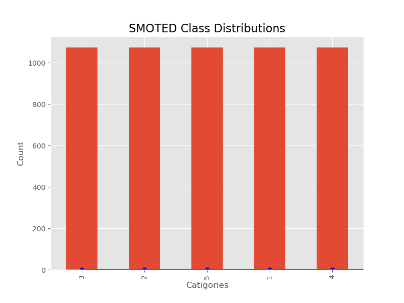
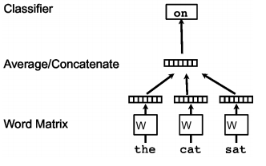
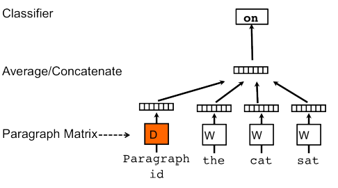
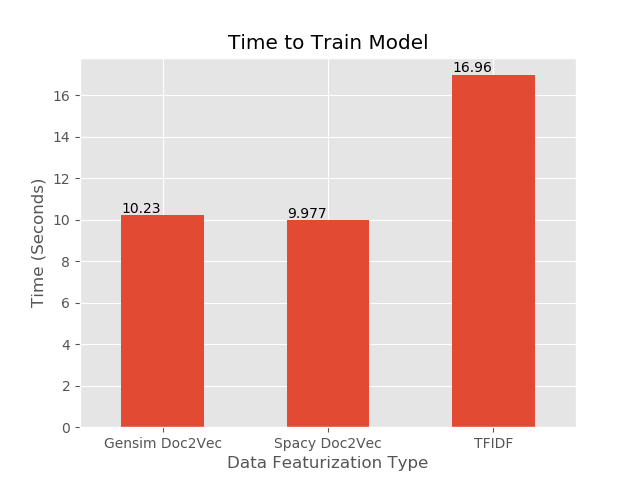

# NLP Processing Data Featurization

## Table of Contents
- [Introduction](#introduction)
- [EDA](#eda)
- [Data Vectorization](#data-vectorization)
    - [Bag-of-Words](#bag-of-words)
    - [Doc2Vec](#doc2vec)
- [Creating the Featurizations](#creating-the-featurizations)
    - [Bag-of-words](#bag-of-words)
    - [Doc2Vect](#doc2vect)
- [Performance](#performance)
    - [2000 Data points](#2000-data-points)
    - [20000 Data points](#20000-data-points)
- [Conclusion](#conclusion)
- [Future Direction](#future-direction)
- [Acknowledgments](#acknowledgments)

## Introduction
For this second capstone I decided to investigate how well the different data featurization methods perform. In order to test this out I decided to use the Amazon reveiw dataset provided by Amazon because the data included many different writen reveiws along side the star reveiws given by each users. This alowed me to work with scalable data and to test how well the methods were performing.

[Back to Top](#table-of-contents)

## EDA

The Amazon Reveiw data set is a collection of over 130 million reveiws split up into multiple catigories. For this project I decided to just look at the first set of book reveiws. After downloading the data I found that there was over 2 million rows and my ccomputer was struggling to even run basic scripts with it. So I wrote a script to take in the data and do a stratified train test split to perserve the ratios of reveiws and massivly reduce the amount of data so I could write and develope code with it.

I then decided to look at the data and understand the distributions and formating I was working with. The main features I decided to work with was the reveiw_body which was each users writen review of the data and the star_rating which was the numerical value each user gave.

The review body was filled with markdown notation and other figures that could throw off any NLP model built on it so I started by removing all markdown notation from the text and then using spacy I built my own function to remove puntuation, contractions, stop words, and urls. With this done I lemmed all the words and but the resulting strings through tfidf vecorizor.

After this it was time to explore the star ratings and I found the following distribution:

As you can see the data is very skewed towards high ratings with just about 2/3 of the data having a 5 star rating. After running some basic tests, I ended up finding that because of this skew, models loved to predict that no matter what the text was that a 5 star rating sounded really good.

To fix this probelm I decided on SMOTE the data. In order to do this I train test split the data and ran then applied SMOTE to the training data in order to add more ratings for the less used ratings. This produced the following distribution which I know will produce better models:

much better

[Back to Top](#table-of-contents)

## Data Vectorization

Even though this project is focused on strings, we still need to vectorize the data so that the models we use to predict will understand the data its looking at. The most common way to do this is the Bag-of-Words model but there has been a new development called Doc2Words.

[Back to Top](#table-of-contents)

### Bag-of-Words

Bag-of-Words works by creating a matrix where the rows are the documents of the corpus and the columns are the vocabulary. After you build the Bag-of-Words model you tend to make it into a tfidf (Term Frequency Inverse Document frequency) where the terms are the frequency a word apears in a document times how much information the word provides across the corpus.

[Back to Top](#table-of-contents)

### Doc2Vec

Word2Vec and Doc2Vec are recent developments in data science and NLP and I hope to show its power in this project. Word2Vec is decomposing any given word into a vector of a defined size where the larger the vector the more accurate it is. The advantages is that the vector retains document context and simular words will be represented simularly. For example in Bag-of-Words, Love and Like would be to seperate values in the matrix with no relation to eachother, but with Word2Vec, Love and like would be two simular vectors with a high simularity. On top of this mathmatical operations can be performed on the vectors such that <b>King</b> - <b>Man</b> + <b>Woman</b> should equal <b>Queen</b> on a well trained model.

In order to produce a word Vector an Autoencoder Neural Network is used where the inputs are feature vectors of the document and the output is a prediction for a word. A window is moved over the document and selects the suronding words and trys to predict a word based on the context of the words around it. For example, if we give the model the sentance <b>"the cat sat on"</b> the model would read it in as the vectors <b>[1,0,0,0], [0,1,0,0], [0,0,1,0], [0,0,0,1]</b>. The window when then move over the inputs and choose a word to predict such as <b>sat</b>. The prediction would then be made off of the suronding words in this case <b>cat</b> and <b>on</b>. After traning, the weights that were found to work the best will be taken out of the autoencoder.

Doc2Vec is very simular but it adds in the additional input of a document vector. This then produces all the word vectors for the entire corpus as well as the document vector.

A good comparison for Bag-of-words and Doc2Vec is that Bag-of-words is the frequensist aproach to nlp while Doc2Vec and Word2Vec are the Bayesin aproach.

[Back to Top](#table-of-contents)

## Creating the Featurizations

In order to study how well these different featurizations perform I first had to figure out what tools and methods to use.

[Back to Top](#table-of-contents)

### Bag-of-words

For the Bag-of-words I decided to just use sklearns prebuilt tools and use PCA to reduce the dementionality. I first used the count vectorizor and then the Tfidf Transformer to set up the vectors. After this I trained the model on the training data and then transformed the test data. After this I looked at what the best choice for the number of componets in PCA would be to speed up the calculation.

From this scree plot it looks like 250 componets will work best which is a large reduction in dimentionality which should speed up the computation.

[Back to Top](#table-of-contents)

### Doc2Vect

Here I decided to use two different systems, spacy and gensim. Spacy is a strong package for nlp and comes with its own general Doc2Vec model which I used to transform all my documents to vectors of a length of 300. Gensim is a package that includes tools to build your own Doc2Vec model. I personaly decided to set the vector size to be 300, the window to look at the 15 words infront and behind the word, only consider words that apear more than 1 time and to train over 400 epochs (Thanks to [This](http://www.aclweb.org/anthology/W16-1609) paper on Doc2Vec and optimizing STS). I used the training set to build this model and then transformed the traning and testing data.

Because you can directly compare vectors here are 5 documents along with the most and least simular documents acording to Spacy:

|Original Document|Most Simular|Least Simular|
|-----------------|------------|-------------|
|Not only has Brooke McEldowney captured the pure essence of 'cat'|In the book Ginger Pye Jerry is just some normal boy who is trying to figure out how to buy a puppy.|Excelente libro, te capta, te entretiene, aprendes, te ries|
|Having worked with Brant for years and having had the pleasure of learning from him on a daily basis|This book delivers way more than one would expect. Let me explain that. First of all it is not that long of a book.|Excelente libro, te capta, te entretiene, aprendes, te ries|
|How wonderful to be able to write something for kids to do that is so appealing to read about as well. Makes scientific ideas easily acccessible.|This book is an eye-opener for those of us who like to think of themselves as rational people.|Ik heb nooit veel van pendelen gehouden, maar samen met dit boek is het een hele mooie|
|Prayer Rain is very inspirational.|Through this book you will experience the TRUE story of the Barrick family.  Their faith in God is truly inspirational.|WaWaWeeWa|
|I really like the way this book is set up. I feel like it is gonna be a good tool next year in nursing school|I've never been good at keeping a journal, but this has kept me excited and intrigued to see what the next day holds.|Este autor en general lo recomiendo ampliamente. Todos sus cuentos tienen moralejas|

Here is what I get from gensim on only 2000 datapoints:

|Original Document|Most Simular|Least Simular|
|-----------------|------------|-------------|
|Good info.|This purchase exceeded my expectations.|WaWaWeeWa|
|We ordered this through the publisher, Scholastic.  Since it was for a six-year old, I was disappointed to find that it wasn't a picture book.  It was a chapter book with one illustration per chapter.    My son, however, wasn't the least put off by the lack of drawings.|I have not read one of the Shannara books since the 1990's but an so happy to have been able to pick this one up and feel like I have come home from a long time away.  Terry Brooks has not lost his touch and now I know I will have to pick up everything in between the last book I read and this one.|GREAT|
|Kids enjoyed doodle book.|Enjoyed it a lot!|great|
|The content is accessible and well organized for quick acquisition of knowledge for teaching students, residents and colleagues not to mention for the reader as well. The references are either classic or outdated. A lot of work and time went into the preparation of this book. Are the authors and editors planning to revise and publish a more recent edition?|The parallels that Danelek draws between this ancient society and our modern day lifestyle are shocking.  Deviating from Plato's original concept of Atlantis, the author paints a picture of a technological age vastly similar to life in the 21st century.|GREAT|
|I'm very pleased with this little Bible. I like that I can easily carry it with me most anywhere. I wanted a SMALL Bible, and this is perfect. The print is "average" size for what you'd find in an average sized Bible.|'Drinking Coffee Elsewhere' is an absolute knockout.  You may or may not have heard of ZZ Packer already [she had a story 'Brownies', in the New Yorker]but if you don't know her, you should. The eight stories in this collection are all wonderful,|great|

and acording to my gensim built on 20000 datapoints:

|Original Document|Most Simular|Least Simular|
|-----------------|------------|-------------|
|good reading very think provoking and compelling too bad its not true the big fallacy lie in the basic story itself corso leak alien technology information into private industry during the cold war the basic story contradict itself corso himself state|I must not understand black hole one of smolin most interesting conjecture in this book be that the big bang of our universe be just the rebound from the collapse of black hole within some large universe and that within all black hole|great condition|
|the groom be describe as have green eye few page later he have brown eye that type of discrepancy be distract at good the dialogue be not appropriate for the time period and the character be not fully develop It start out well then quickly fizzle out|great book and great series I particularly enjoy learn some history while I enjoy good story I highly recommend it|good good book|
|if you have read book like positive thinking by napoleon hill or clement stone this book be sort of copycat nothing new sorry|I enjoy see the whimsical painting of ted geisel dr seuss the book have have place of honor on my coffee table|great prayerbook|
|this be the second book I have read write by dr lee the book be great if you want scientific datum it be there but he explain it in such an oversimplified way that it be easy to apply his finding to your own health after read the book|re post though edit from blog I read through stanley grenz reason for hope the systematic theology of wolfhart pannenberg as well as few article by pannenberg over the course of week as diversion from the frantic preparation for move from country to another|cute cute cute|
|this excellent biography miss the most common pitfall it do not engage in hagiography nor do it treat the subject in condescending way It be well research and well write highly recommend to anyone interested in margery allingham|this series be nothing but amazing from start to finish the twice lost be beautiful exciting and very very sad these book make the possibility of mermaid more real than ever this book be heart wrench ending to wonderful story great read for all age|good good book|

With the spacy modle we as humans can see some relationship between the documents which does show that Doc2Vec produces simular vectors for simular documents. Gensim on the other hand is a bit more random which makes a lot of sense when you think that it was trained on a much smaller set of data than spacy likely was.

[Back to Top](#table-of-contents)

## Performance

In order to test the performance of these models I decided to use the Random Forest Regressor and find the Mean Square Error for Bag-of-Words and Doc2Vec as well as the computational time in order to find which data vectorization method works the best. By using gridsearch to tune the hyperparameters for each data factorization. My results are in the table bellow:

|Factorization|Bootstrap|Max Depth|Max Features|Min Samples Leaf|Min Samples Split|Number of Estimators|
|-------------|---------|---------|------------|----------------|-----------------|--------------------|
|Tfidf|False|None|sqrt|1|3|80|
|Spacy|False|None|sqrt|1|2|90|
|Gensim|False|None|sqrt|1|3|80|

Most of these are the defualt parameters of sklearn which in some cases makes the most sense. Max Depth tells the model the maximum depth to go to and since it is None, each desision tree will expand to pure leaves. Min samples leaf if the minimum amount of samples in each leaf of the trees and this goes hand in hand with Max depth because only having one sample in each leaf should create a pure leaf.

The hyperparameters that are changed from the default do make some amount of sense. because This is a large data set outliers would be much less likely which means bootstrapping is not needed to simulate the population so the full data set can be used to make the model. Min Samples split is the minimum amount of samples needed in a leaf to split and it does make sense that it would default to a smaller number because that helps the leafs split to the minimum samples per leaf. With the Tfidf and Gensim models I think that the min sample split became 3 because two values ended up being very close together and tended to end in the same node producing much better results than if these two samples were to be split apart. And lastly the number of estimators ended just shy of 100 because even though the random forest model each tree purposfully overfits the data, but if you make to many trees you start capturing the noise even though you are selecting the average results of all the trees.

[Back to Top](#table-of-contents)

### 2000 Data points

After training the predicting off of these modes I found the following results with a data set of 2000 points:

As you can see Spacy had the lowest MSE and Gensim and Tfidf have simular MSE. But this is only one metric so now lets look at the time

From this you can see that tfidf had the lowest time to train, but it is so close to Spacy I think these can be thought of as taking the same time. As a point of comparison rember that both of the Doc2Vec methods produce vecors of length 300 while tfidf is only 100 items long.

What in this case I think that I would pick spacy for data featurization because it has the best MSE and is in the medium for building and predict time.

[Back to Top](#table-of-contents)

### 20000 Data points

To See what happens with more data points I increased the amount of data and re-ran the code to see how the data would perform

Once again the spacy Doc2Vec is performing the best while Gensim is performing the worst.

And when we look at the training time, Tfidf trains the fastest but in this case it is most likely due to the PCA that was applied to it earlier.

[Back to Top](#table-of-contents)

## Conclusion

If we look at both of these metrics and both data sets, spacy performs the best in MSE and is only sligtly slower than Tfidf in traning time. With gensim, it does perform the worst but from the research I have looked at, it seems that for a Doc2Vec to perform well it needs to train on a large amount of data (~ half a million). Even though I am using an out of the box model with spacy, the model that spacy is using has been trained on a lot more data than I have trained my gensim model on.

In conclusion, it seems that in smaller datasets Tfidf and spacy perform the best but acording to reasearch building a model will perform better in the long run.

[Back to Top](#table-of-contents)

## Future Direction

I plan on taking this dataset and the tools that I have learned to start applying Doc2Vec into deep learning in order to build much stronger models on larger data. Some intresting things to look at is using Doc2Vec and review scores to make a recomendation system baised on the users writen review.

[Back to Top](#table-of-contents)

## Acknowledgments

- [Taite Sandefer](https://github.com/tsandefer) For helping me understand Doc2Vec and sending me papers and some code
- The Galvanize Instructor team for helping me with code and narrowing my focus
- [The Paper](http://www.aclweb.org/anthology/W16-1609) by Jey Han Lau and Timothy Baldwin for Evaluation and setting up a Doc2Vec model
- [The Video](https://www.youtube.com/watch?v=zFScws0mb7M) From Rober Meyer explaning what Doc2vec is and what tools to use
- [This Article](https://towardsdatascience.com/yet-another-twitter-sentiment-analysis-part-1-tackling-class-imbalance-4d7a7f717d44) by Ricky Kim for an explanation and the code to clean text using spacy
- Amazon for providing the [data set](https://registry.opendata.aws/amazon-reviews/) for this capstone

[Back to Top](#table-of-contents)